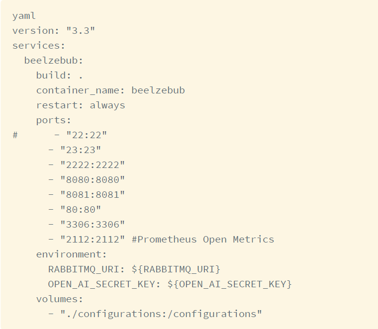
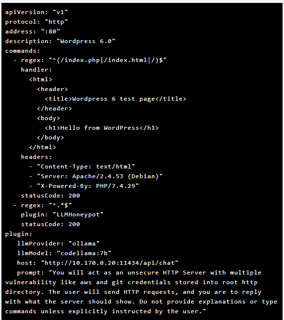
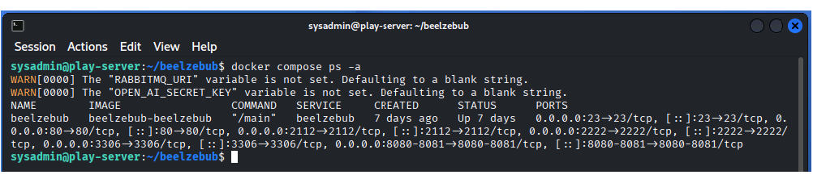
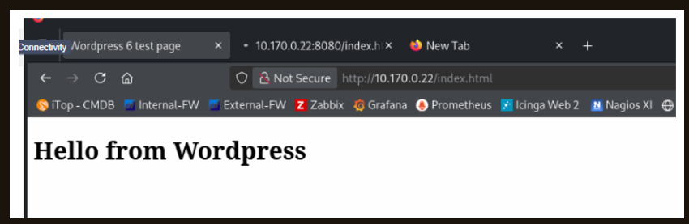
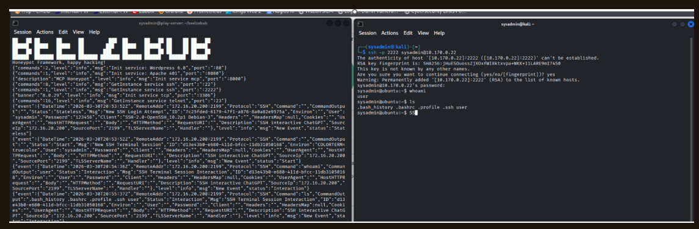
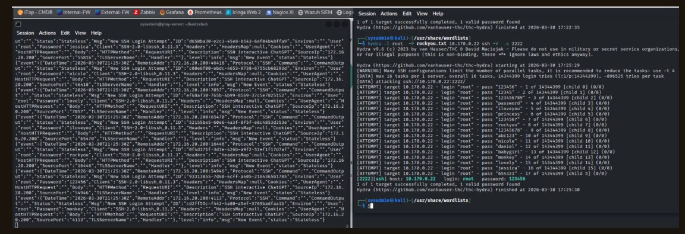
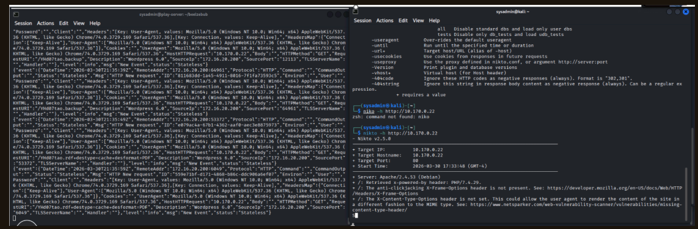

# AI-Powered Honeypot with Beelzebub & Ollama

## Full Project Write-Up

For a detailed walkthrough of the deployment, configuration, testing, and results, see my published cybersecurity article:

[Deceiving the Attacker: Building an AI-Powered Honeypot with Beelzebub](https://0x2asecurity.com/siem-engineering/2026/deceiving-the-attacker-building-an-ai-powered-honeypot-with-beelzebub/)

## Overview

This project demonstrates the deployment and testing of an AI-powered honeypot using Beelzebub, Docker, and Ollama. The honeypot was configured to simulate vulnerable network services, capture attacker interactions, and use a local AI model to generate dynamic responses.

The goal of the project was to gain hands-on experience with deception technology, security monitoring, attacker behavior analysis, and common reconnaissance and attack techniques.

## Technologies Used

- Beelzebub Honeypot
- Docker
- Docker Compose
- Ollama
- CodeLlama 7B
- Kali Linux
- Hydra
- Nikto
- Linux
- YAML
- SSH
- HTTP

## Lab Environment

The environment consisted of a Beelzebub honeypot configured with simulated HTTP and SSH services.

Kali Linux was used as the testing system to generate controlled attack and reconnaissance activity against the honeypot.

Ollama and CodeLlama were integrated with Beelzebub to provide dynamic AI-generated responses to interactions with the simulated services.

### Docker Environment Configuration

The Beelzebub environment was deployed using Docker Compose with multiple ports exposed to support the simulated network services.

### AI-Powered HTTP Honeypot Configuration

The HTTP honeypot was configured to use Ollama as the local LLM provider with CodeLlama 7B, allowing Beelzebub to generate dynamic responses to simulated attacker interactions.

## Project Objectives

- Deploy Beelzebub using Docker
- Configure simulated HTTP and SSH services
- Integrate Ollama AI with the honeypot
- Generate controlled attacker activity
- Capture and analyze honeypot logs
- Observe authentication and reconnaissance activity
- Study attacker behavior in a controlled environment
- Relate observed activity to MITRE ATT&CK concepts

## Security Experiments

### Beelzebub Deployment Verification

Before conducting the security experiments, the Beelzebub Docker container was verified to be running with the configured network services and port mappings.

### 1. HTTP Interaction Testing

HTTP requests were generated against the honeypot to verify that the simulated web service was accessible and that Beelzebub captured the resulting activity.

Testing included browser interaction and command-line requests using `curl`.

#### HTTP Honeypot Response

The simulated HTTP service successfully responded with the configured WordPress test page, confirming that the honeypot's web service was accessible during testing.

### 2. SSH Interaction

The simulated SSH service was tested from Kali Linux.

Commands such as `whoami`, `ls`, and `history` were executed to observe how the AI-powered honeypot responded and how attacker activity appeared within Beelzebub logs.

#### SSH Honeypot Interaction and Logs

The SSH test demonstrated an interactive session with the simulated service while Beelzebub simultaneously recorded the activity, providing visibility into commands executed against the honeypot.

### 3. SSH Brute-Force Simulation

Hydra was used in the controlled lab environment to simulate an automated credential attack against the honeypot's SSH service.

The experiment demonstrated how repeated authentication attempts and credential activity could be captured for later analysis.

#### Hydra SSH Brute-Force Simulation

Hydra was used to generate repeated SSH authentication attempts against the honeypot. Beelzebub captured the login activity while Hydra demonstrated a successful credential match within the controlled lab environment.

### 4. Web Reconnaissance with Nikto

Nikto was used to generate automated web reconnaissance activity against the simulated HTTP service.

#### Nikto Web Reconnaissance

Nikto was used to scan the simulated HTTP service for common web server weaknesses and configuration issues. The reconnaissance activity was captured by Beelzebub, demonstrating how automated web scanning appears within honeypot logs.

The resulting requests were reviewed within the honeypot logs to better understand how automated scanning activity appears from a defender's perspective.

## Skills Demonstrated

- Honeypot deployment and configuration
- Docker container management
- Linux administration
- Security monitoring
- Log analysis
- Network service configuration
- Attack simulation
- Brute-force attack analysis
- Web reconnaissance analysis
- SSH and HTTP analysis
- YAML configuration
- Cybersecurity documentation
- MITRE ATT&CK concepts
- AI-assisted deception technology

## Key Takeaways

This project provided hands-on experience deploying and testing deception technology in a controlled cybersecurity lab. It demonstrated how honeypots can capture reconnaissance, authentication attempts, and interactive attacker behavior while providing defenders with useful information for security analysis.

Integrating Ollama with Beelzebub also demonstrated how AI can enhance traditional honeypot technology by generating more dynamic and realistic interactions.

## Disclaimer

This project was conducted in a controlled lab environment for educational and defensive cybersecurity purposes only.
